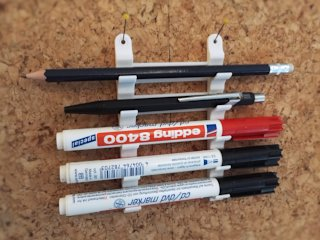
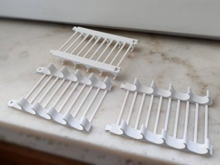
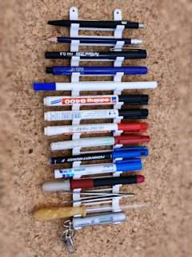
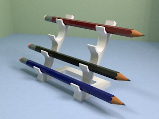

# Customizable Pen Butler
*3D printable modular pen holder that can be attached to a wall, or stand on a desk (formerly thing:1676070)*

### License
[Creative Commons - Attribution](https://creativecommons.org/licenses/by/4.0/)

### Attribution
This is based on sotenck's “Pen butler - beautiful pen holder” ([Thingiverse thing:1670728](https://www.thingiverse.com/thing:1670728)).

### Gallery

[🔎](images/photo1.jpg) [🔎](images/photo2.jpg) [🔎](images/photo3.jpg) [🔎](images/render4.jpg)

## Description and Instructions

I am one of those persons who keeps on collecting clutter on their desk until there isn't even enough free space to arrange some writing utensils or even place an upright pen holder. The solution: start hanging things on the wall.

This started out as a wall-mountable variant on the “Pen Butler” by sotenck (formerly SmartFormat) and initially only came in a few fixed sizes. I upgraded it to OpenSCAD to make it fully customizable, with the option to generate something very similar to sotenck's original model, but then printed in separate parts to avoid the need for supports.

The example STL files are made for a maximum pen diameter of about 12mm.

### Creating a custom pen holder

Open the `.scad` file in [OpenSCAD](https://www.openscad.org/) and **[use the OpenSCAD Customizer](https://www.dr-lex.be/3d-printing/customizer.html)** to create a model with your own desired specifications.

Multiple prints can be connected together: a ‘modular’ top can be clicked into a ‘modular’ bottom. The default tolerance value should work fine with a well-calibrated printer. If you are unsure about the accuracy of your printer, first do some tests by generating the *Tolerance test piece* (‘single’ model with 1 slot, modular top and bottom) with different tolerance values. The tolerance only affects the opening of the dovetail connection, not the lug, so it suffices to print one reference piece and then one piece for each tolerance value you want to try.

To produce the classic *desk* version, you need 2 prints of a `single` model (typically with a ‘none’ `topType`) and 1 `base`. (Make sure to use a base generated for the correct number of slots to end up with a balanced pen holder.) These parts also click together just like the modular parts. You could mount one regular ‘wall’ model on a base if you like the looks of the connecting bars.

### Printing

I printed this at 0.2 mm layers, but finer layers can be used for a smoother result.

There will be a lot of travel moves and retractions, so either take precautions against stringing or be prepared to do some clean-up afterwards.

This should be printed in the position in which the models are generated. For the ‘single’ model, you might be tempted to print the model on its side for smoother curves, but this could cause the modular slots to be messy. Your call.

### Assembly

If the tolerances for the modular parts are good, then you can click the models together and they will be strong enough as-is, with the advantage that you can disassemble it for transport. Of course you can add some glue to make it stronger.

## Updates

### 2016/07/16
First publication on Thingiverse.

### 2017/03/19
Added a ‘smooth’ version that has slightly more elegant curves, and should make it slightly easier to take thicker pens out of the holder.

### 2022/01/01
Migrated to GitHub.
Converted to customizable OpenSCAD file, and added desk version similar to the original.

## Tags

`customizable`, `customizer`, `hanger`, `marker_holder`, `openscad`, `pencil_holder`, `pen_holder`, `Wall_Hanger`, `wall_mount`
